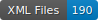

# Data repository for HTR model training

    

## Project

My thesis work concerns the Alsatian poem _Sylua epistolaris seu Barba_ written by Johann Sapidus (1490-1561). My aim is to give an edition, translation and commentary, but my research leads me to study other aspects of this poet. Thus, for each work of Sapidus transcribed for my own purposes, I will share the transcription data in this repository. 

## Data

The data is based on transcriptions by me. 
As long as my work is not finished, the repository will evolve. Please do not use the data until the repository has been finalised. If you are interested in certain datasets, please contact me.

## Table of contents

| Type |  Folder name | Date|  Reference | Source | Pages | Images licence |
| :----- | :----- | :-- | :--------- | :------| :------| ----:|
| print | Apologia | 1534 | _Apologia Ioan. Pierii Valeriani Belunen. Medicum familiæ Rhetoris. Pro sacerdotum Barbis. Sylua epistolaris seu Barba Ioan. Sapidi, propter argumenti cognationem adiecta_, Strasbourg, Johann Albrecht, 1534 (VD16 ZV 15141) | [Universitäts- und Landesbibliothek Sachsen-Anhalt, Ung III A 170 (2)](http://dx.doi.org/10.25673/opendata2-175) | 88| <a rel="license" href="https://creativecommons.org/publicdomain/mark/1.0/"></a><br />

## Licence

- For the images, see the [_Universitäts- und Landesbibliothek Sachsen-Anhalt_](https://bibliothek.uni-halle.de/).

- For the transcription, <a rel="license" href="http://creativecommons.org/licenses/by/4.0/">Creative Commons Attribution 4.0 International Licence</a>. <a rel="license" href="http://creativecommons.org/licenses/by/4.0/"></a><br />

## How to cite

Marie Jeannot-Tirole, _Data repository for HTR model training_, université de Strasbourg et de Genève, Genève, 2023.

```bibtex
 @misc{jeannotHTR2023,
    autor = {Jeannot-Tirole, Marie},
    title = {Data repository for HTR model training}, 
    year = {2023},    
    location= {Strasbourg/Geneva}
}
